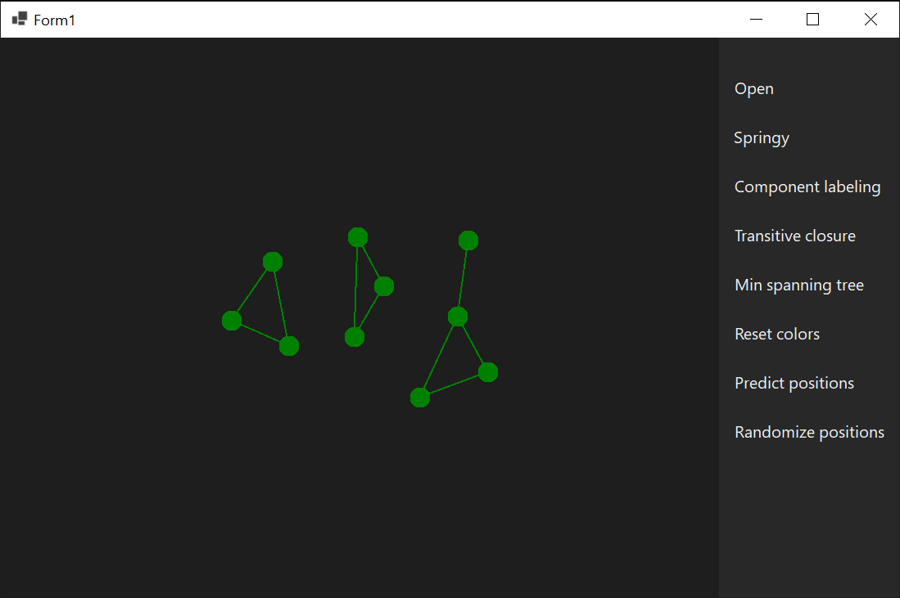
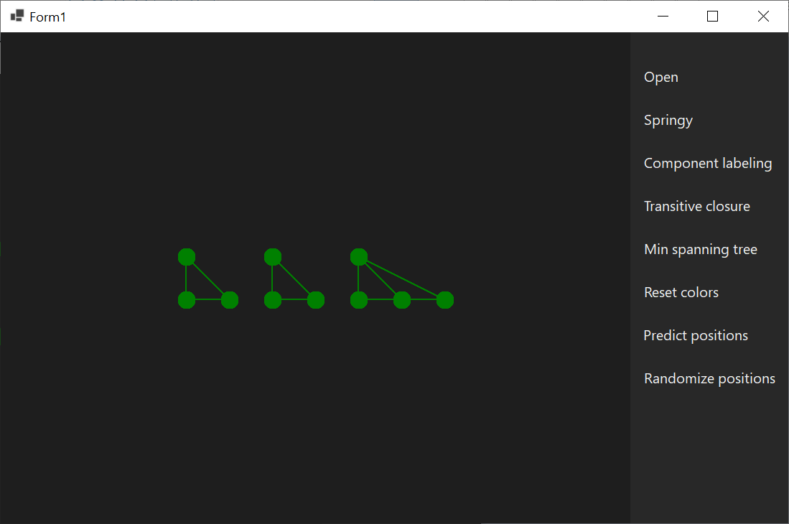
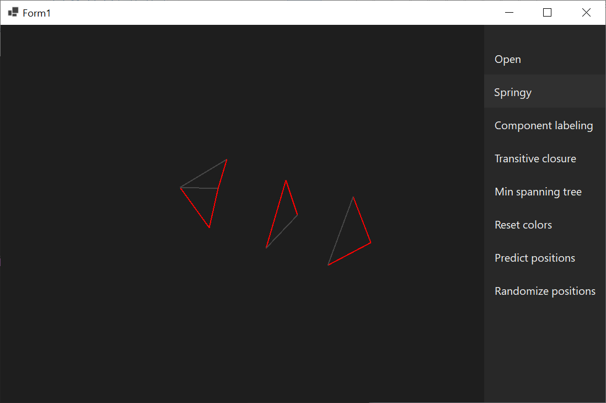
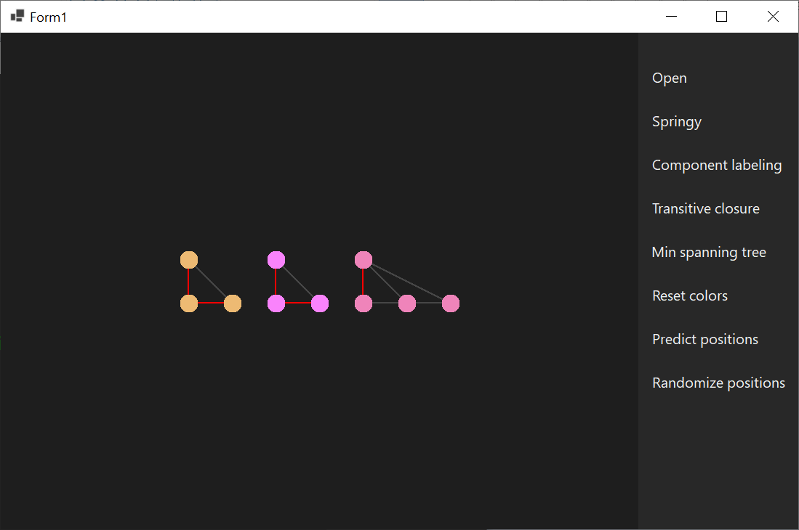

# Graph Visualization

## Run

`cd .\GraphVisualization\ ; dotnet run`

## Input

`‘v ’ <int> ‘\n’ [‘l ’ <int> ‘ ’ <int> ‘\n’]+`
 - First integer is number of vertices.
 - Second and third integers are indices of an edge.

## Screenshots

